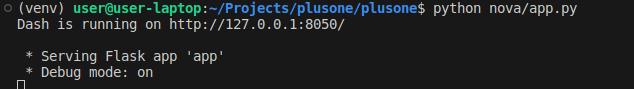
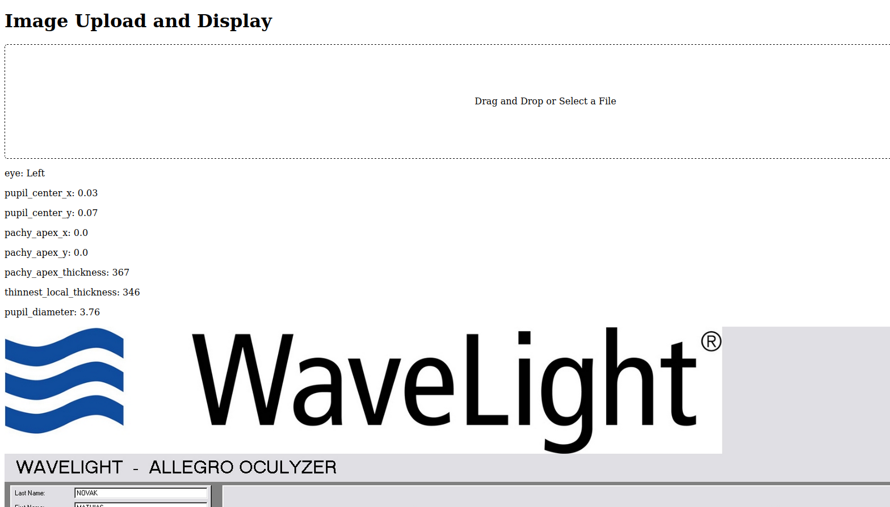
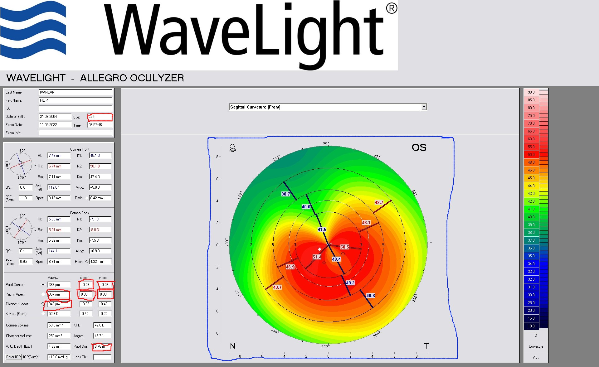

# How to start the app?

Change to the parent project directory and run the following commands:

Assuming you have venv installed:
```bash
source venv/bin/activate
```

If not, then:
```bash
python3 -m venv venv
source venv/bin/activate
```

Then install the requirements:

```bash
pip install -r nova/requirements.txt
```

Then run the following command:
```bash
python nova/app.py
```

You should be able to access the app by visiting the URL displayed in the terminal, like this:



# First steps

Try to upload the image from `nova/data` and see what happens.

After uploading an image you should see something like this:



# The app and the task

A simple app, that allows the user to upload the image and 
then the app will display relevant data and cropped image.

Currently, the app will display the same image that was uploaded and
couple of hardcoded numbers.

The task here is to extract the data labelled with red rectangles and
to crop the image by the blue rectangle. Refer to the image below:



Feel free to create your own functions and classes, but there is no need to change the existing ones - except the `extract_data` function!

In `nova/data` folder, you can find couple of images that will
be useful when developing and testing the app.

If you will go through the images in the `nova/data` folder, you will notice that the images and the relevant data is always in the same place.

Use that to your advantage by:
- hardcoding the coordinates of the rectangles
- cropping image from that rectangle 
- extracting the data from cropped image

You can repeat this process for all "red" rectangles.

The blue rectangle, it's just cropping the image and returning the cropped image. So, it's similar to the red rectangles, but without the text extraction. 

I'm not familiar with the image-to-text libraries, so I will leave it up to you to decide which one to use. 

As for image cropping and editing, I recommend using the Pillow library, but you can use any other library/libraries that you see fit for the task.

The task is successfully completed when the app will display the cropped image (blue rectangle) and the extracted data (red rectangles) from an uploaded image.

If there are any questions, do not hesitate to hit me up on Slack!

Good luck!
